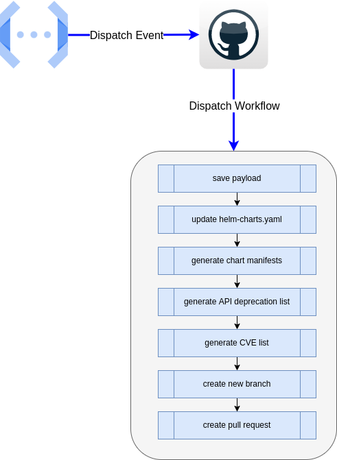

# artifacthub2github example usage implementation

This folder contains an example implementation for the usage of the

serverless function [artifacthub2github](https://github.com/300481/artifacthub2github).



## Files and Folders

### [.github/workflows/update-chart-versions.yml](https://github.com/300481/actions-test/blob/main/.github/workflows/update-chart-versions.yml)

This file is the workflow, which is triggered by the serverless function.

It will:

* update the helm-charts.yaml file

* generate the chart manifests

* create a branch for the updated files

* create a pull request against the main branch

### [update-chart-versions.sh](https://github.com/300481/actions-test/blob/main/artifacthub2github/update-chart-versions.sh)

The script which runs by the triggered workflow to update the helm-charts.yaml.

### [generate-helm-manifests.sh](https://github.com/300481/actions-test/blob/main/artifacthub2github/generate-helm-manifests.sh)

The script which runs by the triggered workflow to generate the manifest-files.

### [chart-values](https://github.com/300481/actions-test/tree/main/artifacthub2github/chart-values)

This folder contains the Helm Values for the charts.

You can have multiple values files to generate multiple manifests, for example for *`DEV`*, *`TEST`*, *`STAGING`* and *`PRODUCTION`*.

### [chart-manifests](https://github.com/300481/actions-test/tree/main/artifacthub2github/chart-manifests)

This folder contains the generated chart manifest files for the charts and its corresponding values files.

### [example-payloads](https://github.com/300481/actions-test/tree/main/artifacthub2github/example-payloads)

This folder contains some example payloads to test the proper

function of the serverless function as of the worflow and scripts.

#### Example *curl* command for testing

```bash
curl -d @./example-payloads/argo-cd-payload.json -H "X-ArtifactHub-Secret: [YOUR-ARTIFACTHUB-SECRET]" https://[YOUR-GCP-PROJECT].cloudfunctions.net/[YOUR-FUNCTION-NAME]
```